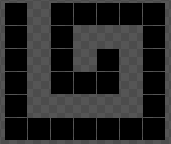

На вход подаются N и M - высота и ширина поля соответственно. Из левого верхнего угла против часовой стрелки начинается спираль. Вывести, сколько пикселей будет закрашено.

Ввод:  
`6`  
`7`  
Вывод:  
`27`

