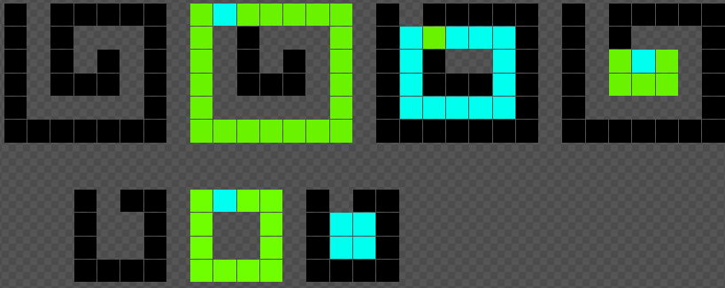
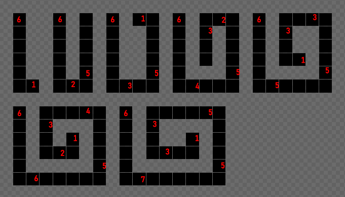

# Полёт мысли
1. Постоянное отношение незакрашенных клеток к закрашенным. При первой же проверке провал.  
2. Можно обучить какую нибудь модель ML, было бы забавно) Но пришлось бы считать самостоятельно все пиксели по несколько десятков для обучения, не стал заниматься этим просто веселья ради.
3. Разбить прямоугольник на несколько матрёшкой:  
  
Но я не смог додумать это решение. Возможно, оно и имело бы прао на жизнь.

# Решение
Решение пришло, когда рисовал несколько спиралей от `6x2` до `6x12` и считал всё, что считалось: пиксели, отношение закрашенных к незакрашенным, отношение площади поля к числу витков.  
Обнаружил, что количество линий в спирали = ширине, если ширина <= высоты. В случае, если ширина больше, то кол-во линий = высоте + 1.
Количество пикселей же уменьшается каждый раз на два (1 за пустое место и 1 за уже закрашенный пиксель).  
  
Таким образом, вот непричёсаный код для решения:
```python
N = int(input())
M = int(input())
count = N
N -= 1
M -= 1
for i in range(0, min(N + 1, M)):
    if i % 2 == 0:
        count += M
        M -= 2
    else:
        count += N
        N -= 2
print(count)
```
